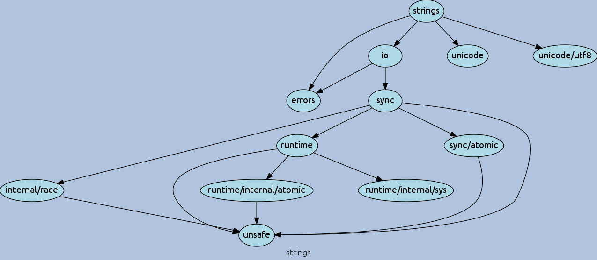
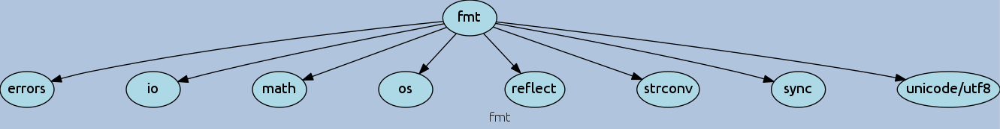

# go-dependency-graph

Purpose of this tool is to provide a visual dependency overview of your program.

## Required For Visual

```sh
sudo apt-get install graphviz
```

## Install

```sh
go get github.com/tanmoyopenroot/go-dependency-graph
```

### Command-Line

Simply execute main.go with one or more package names to visualize.

```sh
$ go run main.go const.go dot-graph.go generate-dependency-graph.go show-dependency-tree.go dot-template.go -show-std=true strings
Arguments:  [strings]
strings
 ├ errors
 ├ io
   ├ errors
   └ sync
     ├ internal/race
       └ unsafe
     ├ runtime
       ├ runtime/internal/atomic
         └ unsafe
       ├ runtime/internal/sys
       └ unsafe
     ├ sync/atomic
       └ unsafe
     └ unsafe
 ├ unicode
 └ unicode/utf8
```

This generates a Graphviz's dot format file, to view execute the following:

```sh
$ dot -Tpng strings.dot -o strings.png
$ eog strings.png
```



### -level and -show-std

Decide your dependency graph level and also choose whether to show standard library.

```sh
go run main.go const.go dot-graph.go generate-dependency-graph.go show-dependency-tree.go dot-template.go -show-std=true -level=1 fmt
Arguments:  [fmt]
fmt
 ├ errors
 ├ io
 ├ math
 ├ os
 ├ reflect
 ├ strconv
 ├ sync
 └ unicode/utf8
```

